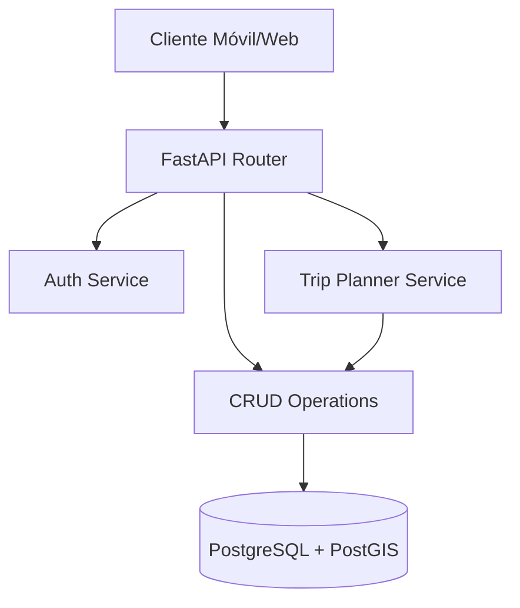

# 🚌 Planificador de Rutas de Micros - Santa Cruz de la Sierra

> **Sistema de Información Geográfica (SIG) para la optimización del transporte público urbano.**

---

## 📋 Tabla de Contenidos
1. [Descripción General](#-descripción-general)
2. [Arquitectura del Sistema](#-arquitectura-del-sistema)
3. [Tecnologías Utilizadas](#-tecnologías-utilizadas)
4. [Instalación y Despliegue](#-instalación-y-despliegue)
5. [Documentación de la API](#-documentación-de-la-api)
6. [Modelo de Datos](#-modelo-de-datos)
7. [Testing](#-testing)

---

## 📖 Descripción General

Este proyecto es el backend de una plataforma integral diseñada para modernizar la experiencia del transporte público en Santa Cruz de la Sierra. Permite a los usuarios planificar sus viajes de manera eficiente, conocer las rutas exactas de los micros, y estimar tiempos de llegada. Para los administradores, ofrece herramientas robustas para la gestión de líneas, paradas y recorridos.

### Funcionalidades Clave
- **🗺️ Planificador Inteligente**: Algoritmo de búsqueda de rutas óptimas (A* / Dijkstra adaptado) considerando transbordos y caminatas.
- **📍 Geolocalización Precisa**: Gestión de coordenadas espaciales para paradas y recorridos utilizando PostGIS.
- **🛡️ Seguridad**: Autenticación JWT y gestión de roles (Administrador/Usuario).
- **💳 Gestión de Pagos**: Registro de transacciones y saldo de usuarios (Simulación).

---

## 🏗️ Arquitectura del Sistema

El sistema sigue una arquitectura en capas limpia y escalable:

- **Capa de Presentación (API)**: Endpoints RESTful construidos con FastAPI.
- **Capa de Servicio**: Lógica de negocio compleja (Planificador de viajes, Autenticación).
- **Capa de Acceso a Datos (CRUD)**: Interacción con la base de datos mediante SQLAlchemy.
- **Capa de Modelo**: Definición de entidades y esquemas de validación.



---

## 🛠️ Tecnologías Utilizadas

| Categoría | Tecnología | Descripción |
|-----------|------------|-------------|
| **Lenguaje** | Python 3.9+ | Lenguaje principal del backend. |
| **Framework** | FastAPI | Framework moderno y de alto rendimiento para APIs. |
| **Base de Datos** | PostgreSQL | Base de datos relacional robusta. |
| **Geoespacial** | PostGIS | Extensión para objetos geográficos. |
| **ORM** | SQLAlchemy | Mapeo objeto-relacional. |
| **Validación** | Pydantic | Validación de datos y gestión de configuraciones. |
| **Contenedores** | Docker | Despliegue consistente y aislado. |

---

## 🚀 Instalación y Despliegue

### Requisitos Previos
- [Docker](https://www.docker.com/) y Docker Compose
- Git

### Despliegue Rápido (Recomendado)

1.  **Clonar el repositorio:**
    ```bash
    git clone <url-del-repositorio>
    cd backend
    ```

2.  **Configurar variables de entorno:**
    Copia el archivo de ejemplo y ajústalo si es necesario.
    ```bash
    cp .env.example .env
    ```

3.  **Iniciar los servicios:**
    ```bash
    docker-compose up --build -d
    ```

4.  **Verificar instalación:**
    - API: `http://localhost:8000`
    - Documentación Interactiva: `http://localhost:8000/docs`

---

## 📡 Documentación de la API

La API está completamente documentada bajo el estándar OpenAPI. Una vez iniciado el servidor, puedes acceder a:

- **Swagger UI**: `http://localhost:8000/docs` - Interfaz visual para probar endpoints.
- **ReDoc**: `http://localhost:8000/redoc` - Documentación técnica detallada.

### Endpoints Principales

| Método | Endpoint | Descripción |
|--------|----------|-------------|
| `POST` | `/auth/login` | Iniciar sesión y obtener token JWT. |
| `GET`  | `/lines/` | Listar todas las líneas de micro activas. |
| `POST` | `/trips/plan` | Planificar un viaje entre dos coordenadas. |
| `GET`  | `/stops/` | Obtener todas las paradas registradas. |

---

## 💾 Modelo de Datos

El esquema de base de datos está diseñado para soportar operaciones espaciales eficientes.

- **Usuarios**: Información de perfil, roles y saldo.
- **Líneas**: Datos generales de las líneas de micro (nombre, color).
- **Paradas**: Ubicación geográfica (Punto) y descripción.
- **Recorridos**: Secuencia ordenada de paradas que conforman una ruta.
- **Viajes**: Historial de viajes planificados por los usuarios.

---

## 🧪 Testing

El proyecto incluye una suite de tests para asegurar la calidad del código.

Para ejecutar los tests (dentro del contenedor Docker):

```bash
docker-compose exec web pytest
```

---
**Desarrollado por el Equipo de SIG - UAGRM**
